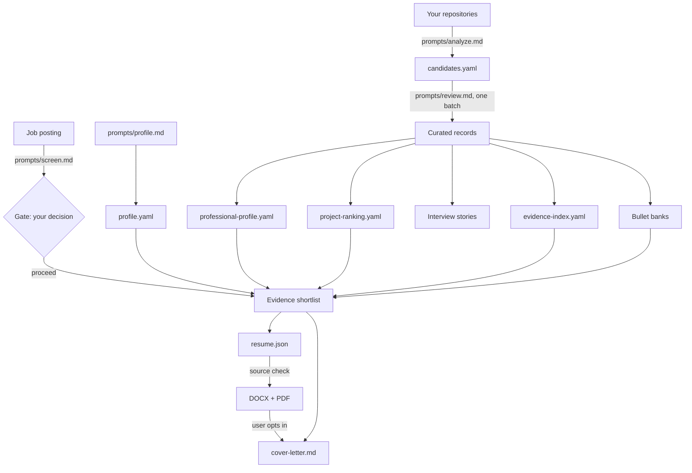

# Engineering Knowledge Base Toolkit

**Turn your Git history into career evidence you can actually defend.**

An open-source toolkit for Flutter engineers who want a resume, an interview
answer, or a professional summary that is backed by a specific commit range
rather than by a confident adjective.

You point it at your repositories. It extracts what you actually did, asks you
to confirm what it could not observe, and stores the result as structured,
provenance-tagged records. Every generated document then cites those records,
and a checker refuses to render anything that does not.

Nothing is uploaded. Nothing is published. Everything is a local file you own.

---

## Contents

- [Why this exists](#why-this-exists)
- [Who it is for](#who-it-is-for)
- [Core concepts](#core-concepts)
- [Install](#install)
- [Quick start](#quick-start)
- [Folder structure](#folder-structure)
- [Guides](#guides)
  - [Create your engineering profile](#1-create-your-engineering-profile)
  - [Analyze a repository](#2-analyze-a-repository)
  - [Review the candidates](#3-review-the-candidates)
  - [Build the derived profiles](#4-build-the-derived-profiles)
  - [Generate interview stories](#5-generate-interview-stories)
  - [Generate resume evidence](#6-generate-resume-evidence)
  - [Screen a job posting](#7-screen-a-job-posting)
  - [Generate a tailored resume](#8-generate-a-tailored-resume)
  - [Generate a cover letter](#9-generate-a-cover-letter)
  - [Generate a professional summary](#10-generate-a-professional-summary)
- [Recommended workflow](#recommended-workflow)
- [Configuration](#configuration)
- [Best practices](#best-practices)
- [Command reference](#command-reference)
- [FAQ](#faq)
- [Limitations](#limitations)
- [Roadmap](#roadmap)
- [Contributing](#contributing)
- [License](#license)

---

## Why this exists

Ask an engineer what they built two years ago and you get a shrug. Ask an LLM to
write a resume from that shrug and you get "spearheaded innovative solutions
leveraging cutting-edge technologies."

Both problems have the same cause: **the evidence exists, in Git, and nobody
reads it.**

This toolkit reads it. But reading Git is the easy half. The hard half is
knowing what you may honestly say about what you find, and that is what most of
this repository actually is:

- A commit proves a change was made. It does not prove **you** made it — squash
  merges, pairing, cherry-picks, and shared CI accounts all exist. So records
  carry an `involvement` level that Git can raise to `contributed` and never to
  `led`.
- A refactor is not "improved performance" unless something was measured. So
  comparative language requires before/after evidence, and neutral wording is
  used otherwise.
- "No evidence found" is not "did not happen". So every analysis run records
  what it could not see.
- A number a developer can raise by splitting a file is not an achievement. So
  test counts, file counts, and commit counts never reach a document.

The result is a resume you can be interviewed about. That is the entire design
goal, and every rule in it exists because the alternative produces a document
that collapses on the first follow-up question.

## Who it is for

**Flutter engineers** who have shipped things and cannot remember the details.
Contractors with a dozen client apps. Engineers whose best work is under NDA and
who need to describe it without naming it. Anyone who has stared at a blank
resume knowing they did more than it says.

**It is not for you** if you want a resume in five minutes. The first project
takes about half an hour of your attention. The payoff is that every application
after that is fast, and every claim in it has a commit behind it.

You will need an AI coding agent — Claude Code, Codex, Gemini CLI, Cursor, or
anything that can read files and run commands. The toolkit is prompts plus
deterministic scripts; the agent is what drives them.

## Core concepts

### The record

The atom of the system. One defensible technical claim, plus everything needed
to defend it.

```yaml
- id: fittrack-001
  statement: >
    Replaced three overlapping local-cache implementations with a single
    repository-backed store, so a stale workout entry could no longer survive
    a failed sync and reappear on the history screen.
  kind: repo-verified          # where this came from
  involvement: implemented     # what you may claim about your part
  evidence:                    # what a reader could open to check it
    - range: 7a1e4c2..b3d9f01
    - path: lib/data/workout_repository.dart
      at: b3d9f01
  reasoning: >                 # how the evidence supports the statement
    The diff removes two cache classes and eleven call sites...
  limitations: >               # what could change how this is worded
    Reproduced in a test, not measured in production. No before/after timing,
    so comparative performance wording is not supported.
```

The test for a good `statement`: **could you say this sentence out loud in an
interview and then answer three questions about it?**

### Provenance — `kind`

| Kind | Meaning | May reach a resume? |
|---|---|---|
| `repo-verified` | Directly observable in the repository at stated commits | Yes |
| `user-stated` | You said it, and confirmed it | Yes |
| `inferred` | The agent's reasoning, with its basis and uncertainty stated | **No** |

An inference can guide private selection and can appear in interview prep when
visibly labelled. It can never become a resume line.

### Participation — `involvement`

| Level | Supports |
|---|---|
| `led` | Leadership wording, within the confirmed scope. Never inferred from Git. |
| `implemented` | Direct implementation wording. Does not imply nobody else helped. |
| `contributed` | "Worked on", "contributed to", at feature level. No component accounting needed. |
| `team-context` | Understanding the system. Not a personal claim. |
| `unknown` | Same. Still worth storing. |

### The workspace

**The toolkit and your knowledge base are separate trees.** You pull updates to
one; the other is yours and never leaves your machine.

```
ekb-toolkit/          the toolkit: prompts, scripts, config, templates
  workspace/          YOUR knowledge base (gitignored; give it its own repo)
```

Point `paths.workspace` in `config/toolkit.yaml` anywhere you like.

### Derived files license nothing

Four files are generated from your curated records: the professional profile,
the project ranking, the evidence index, and the per-application shortlist.

Each one makes evidence easier to **find** or to **order**. None of them makes
anything **claimable**. A high rank is not a fact about your work. An index row
is not a source. Every visible line in a generated document cites the curated
record itself.

## Install

```bash
git clone https://github.com/<you>/ekb-toolkit.git
cd ekb-toolkit
pip install -r requirements.txt      # optional: only needed to render resumes
scripts/ekb doctor
```

`ekb doctor` tells you what is present and what is missing.

**Minimum**, to build a knowledge base and generate Markdown artifacts:

- Python 3.10+ with PyYAML
- Git
- an AI coding agent

**Additionally**, to render DOCX and PDF resumes:

- `python-docx`, `reportlab`, `pypdf` (`pip install -r requirements.txt`)
- Ruby 3.0+ for the source-eligibility checker

Then scaffold your workspace:

```bash
scripts/ekb init
cd workspace && git init && cd ..
```

Add `scripts/ekb` to your `PATH` if you want to drop the prefix.

## Quick start

Open your agent in the toolkit directory and say:

```text
Follow prompts/guide.md
```

That is the only thing you need to remember. The guide reads your state, picks
the next step, and does as much as it can before asking you anything.

Or drive it explicitly:

```text
Follow prompts/profile.md
Follow prompts/analyze.md with REPO_PATH=/absolute/path/to/your/repo PROJECT=myapp
Follow prompts/review.md with PROJECT=myapp
Follow prompts/interview.md with PROJECT=myapp
```

**Want to see the output before doing any work?** A complete fictional knowledge
base ships in [`examples/sample-workspace/`](examples/sample-workspace/): two
projects, a profile, a job posting, an evidence shortlist with authored
decisions, an interview guide, and a validated resume model.

```bash
EKB_WORKSPACE=$PWD/examples/sample-workspace scripts/ekb index
EKB_WORKSPACE=$PWD/examples/sample-workspace scripts/ekb check
```

## Folder structure

```
ekb-toolkit/
├── AGENTS.md                 rules that bind every agent. Read this first.
├── CLAUDE.md, GEMINI.md      pointers to AGENTS.md
│
├── prompts/                  the procedures. Each one is a self-contained job.
│   ├── guide.md              single entry point; routes everything else
│   ├── analyze.md            repository -> candidate records
│   ├── review.md             candidates -> curated knowledge (one batch)
│   ├── profile.md            your confirmed facts
│   ├── professional-profile.md  what holds across projects (derived)
│   ├── rank.md               job-independent project ordering (derived)
│   ├── screen.md             the pre-application gate
│   ├── resume.md             evidence selection for a tailored resume
│   ├── resume-presentation.md  how the document looks
│   ├── cover-letter.md       optional letter after a tailored resume
│   ├── interview.md          interview stories with follow-up questions
│   ├── bullets.md            single-project bullet bank
│   ├── summary.md            professional summaries for any venue
│   ├── status.md             where every project stands
│   └── checkpoint.md         local Git checkpoints
│
├── config/                   everything you are meant to change
│   ├── toolkit.yaml          paths, budgets, eligibility, defaults
│   ├── screening-criteria.yaml  what to flag in a posting (ships neutral)
│   ├── resume-policy.json    layout, ATS structure, writing style
│   ├── review-rubric.json    how selection quality is scored
│   └── capability-tags.yaml  tag vocabulary folding
│
├── profiles/                 role profile packs — the extension point
│   └── flutter-engineers/    alignment anchors, analysis hints, exclusions
│
├── scripts/                  the deterministic half
│   ├── ekb                   one CLI for every operation
│   ├── ekb_index.py          build the evidence retrieval table
│   ├── ekb_shortlist.py      per-requirement candidate evidence
│   ├── ekb_check.py          cross-file consistency
│   ├── ekb_skills.py         recompute the evidence behind your skills list
│   ├── ekb_compare.py        score two competing resume drafts
│   ├── resume_render.py      DOCX and PDF rendering
│   ├── resume_source_check.rb  source eligibility and coverage grading
│   └── ekb_git.sh            local checkpoints, never pushes
│
├── templates/                starting shapes for every file you will own
├── schema/                   JSON Schema for the resume model
├── examples/sample-workspace/  a complete fictional knowledge base
├── docs/                     concepts, architecture, configuration, extending
└── workspace/                YOUR knowledge base (gitignored)
```

## Guides

### 1. Create your engineering profile

```text
Follow prompts/profile.md
```

This is the one place identity facts live: name, contact, employment timeline,
education, certifications, languages, links, skills, and **responsibilities**.

Two things are worth understanding before you start.

**The link registry.** `profile.yaml` is the only place a generated document may
take a URL from. Every rendered address must be recorded there with
`link_status: confirmed`. A URL cannot be guessed, constructed from a company
name, or copied out of an old resume. This is why collecting links happens here,
once, rather than in every application.

**Responsibilities are the only route for work that leaves no Git trace.**
Client meetings, requirements gathering, solution design, production support,
mentoring: none of it is in a commit log. Without an entry here, none of it can
appear in any document. Each entry carries `phrasings`, a closed vocabulary that
sourced text may draw from, which is what stops a responsibility quietly growing
between applications.

You will also be asked once about Git privacy consent, because **Git history
preserves deleted personal information**. A missing answer behaves as declined.

### 2. Analyze a repository

```text
Follow prompts/analyze.md with REPO_PATH=/absolute/path/to/repo PROJECT=myapp
```

The target repository is **read-only**. The toolkit never modifies it and never
executes its code, builds, tests, or package-manager commands. It verifies at
the end that `git status` is byte-identical to what it was at the start.

The output is `projects/myapp.candidates.yaml`: three to seven candidate records
on a first pass, not repository documentation. The budget is in
`config/toolkit.yaml` and it is a budget, not a quota — a thin repository should
produce two records, not seven padded ones.

**Later runs need no path.** The analysis header stores the HEAD it reached, so:

```text
Follow prompts/analyze.md with PROJECT=myapp
```

picks up from there. Add `DEPTH=deep` for a project that matters enough to
examine fully.

Before analyzing employer or client code, check `EXCLUSIONS.md` in your
workspace, and check that the repository may be sent to your agent's provider at
all. No exclusion list makes that decision for you.

### 3. Review the candidates

```text
Follow prompts/review.md with PROJECT=myapp
```

This is **one batch decision**, not a candidate-by-candidate interrogation. The
agent verifies every piece of evidence first, then shows you a numbered list
with the statement, provenance, involvement, one material limitation, and
whether the evidence check passed.

You answer once:

```text
save all and confirm the likely context
save all except 2 and 5
edit 3: it was a support report, not a planned refactor
show evidence for 4
```

High-risk items are separated out: leadership claims, measured results, business
impact, and whether you participated at all. Those get asked individually,
because they are the ones Git cannot answer.

This is the only procedure that writes `projects/myapp.yaml`, and it creates a
`myapp/v1` Git tag when it is done.

### 4. Build the derived profiles

After two or three curated projects:

```text
Follow prompts/professional-profile.md
Follow prompts/rank.md
```

The **professional profile** is what holds across projects: recurring strengths
with tiers, the career map placing each project under the right employer, and
the standing constraints that bind every artifact. Constraints are the most
valuable part and the most often skipped — a counting rule that says a reused
component is one piece of work, not one per app, is invisible inside any single
project file.

The **ranking** orders every project by professional value, independent of any
job. It exists because selection under time pressure defaults to recency, and
recency is a bad proxy for value. Ranks are private and never appear in a
document.

### 5. Generate interview stories

```text
Follow prompts/interview.md with PROJECT=myapp
```

Three stories by default, each with feature context, motivation, your
participation, the decision, the result, the trade-offs, the evidence to re-read
the night before, and **the three follow-up questions an interviewer would
actually ask**.

The follow-ups are the part worth having. A story that survives its own telling
and collapses on "why not the other approach?" has not helped anyone.

### 6. Generate resume evidence

```text
Follow prompts/bullets.md with PROJECT=myapp
```

Three to five polished bullets from the strongest records, plus a `Not selected`
audit listing what was considered and why it was passed over.

This is worth doing per project even if you are not applying anywhere. The
wording gets distilled once, close to the evidence, and the evidence index lifts
it later as a starting point during resume drafting.

### 7. Screen a job posting

```text
Follow prompts/screen.md with JOB_DESCRIPTION=<paste>
```

Five checks against your standing policy: domain exclusions, work authorization,
language requirements, role alignment, and hard requirements. Output is a report
under 300 words, and then it **stops and waits for your decision**.

It waits at every verdict, including a clean one. The confirmation is the
feature.

Why it exists: a full resume run reads your records, builds a shortlist, drafts,
renders, and validates. Discovering afterwards that the posting says "no
sponsorship" wastes all of it. The gate reads three files and stops.

**The domain-exclusion list ships empty.** People decline sectors for ethical,
religious, legal, health, or personal reasons, and the toolkit has no opinion
about which. Fill it with yours, or leave it empty and the check reports that it
was not configured. See `config/screening-criteria.yaml`.

A declined screening is kept. It records why an opportunity was not pursued, and
it stops the same posting being screened twice.

### 8. Generate a tailored resume

```text
Follow prompts/resume.md with JOB_DESCRIPTION=<paste>
```

The screening gate runs first. After you answer `proceed`:

1. **Freeze** the posting and audit every requirement into a structured list.
2. **Retrieve** — build the evidence index and the per-requirement shortlist.
3. **Decide** — for each requirement, pick the winning record and write down why
   it beat the runner-up.
4. **Draft** the resume model with a private source reference on every visible
   fact.
5. **Validate and render** DOCX and PDF, then look at the pages.

```bash
scripts/ekb render 2026-03-14-northwind-flutter-engineer
scripts/ekb render 2026-03-14-northwind-flutter-engineer --ats-plain
```

Three things happen automatically: entities are hyperlinked from the registry,
matched requirement terms are bolded once per section, and a direct-language
gate rejects em dashes and generic filler wording.

**Step 3 is where resume quality comes from.** Writing the comparison down is
most of the value. The failure it prevents is a required requirement answered by
a skills-list token while the strongest record on that exact capability sits
unused two files away — obvious on paper, invisible in the middle of drafting.

The validation report carries a private **selection score**. It measures how
well the resume used the evidence available to it, never your fit for the job:
requirements with no eligible evidence are excluded from every denominator, so
an honest gap cannot lower it.

After delivery, the agent asks whether you want a tailored cover letter. It is
never generated without your opt-in.

### 9. Generate a cover letter

Answer `yes` after a job-targeted resume, or ask directly:

```text
Follow prompts/cover-letter.md with APPLICATION_ID=<existing-id>
```

The module reuses the completed application's frozen posting, shortlist, and
validated resume. It writes `artifacts/applications/<id>/cover-letter.md` using
three paragraphs: motivation and hook, value fit and proof, then call to action
and closing. Candidate claims retain hidden source comments, and unstated
company enthusiasm, recipient details, or mission alignment are omitted rather
than guessed.

### 10. Generate a professional summary

```text
Follow prompts/summary.md with VENUE=profile-about
```

Venues: `resume`, `profile-headline`, `profile-about`, `portfolio`,
`cover-letter`. Each has its own word budget and voice.

A summary is the one piece of career writing with no single record behind it,
which makes it the easiest place for an unsupported claim to hide. The rule is
therefore stricter here: cross-project claims use composed sources, every one of
which must be independently eligible.

## Recommended workflow

**First week.** Profile, then your two or three strongest projects. Analyze,
review, generate interview stories. Stop there. You now have something useful
even if you never apply anywhere.

**Then, per project as you finish work.** Analyze incrementally — it picks up
from the last HEAD. Review the batch. Regenerate the bullet bank.

**Before applying.** Refresh the ranking if you have curated anything new.
Screen the posting. Then generate.

**Every few months.** Re-run `prompts/professional-profile.md` so recurring
strengths reflect what you have actually accumulated, and `scripts/ekb skills`
to see whether your skills list still matches your evidence.



## Configuration

Everything you are meant to change lives in `config/`. No prompt hardcodes a
preference that belongs to one person's career.

| File | Controls |
|---|---|
| `toolkit.yaml` | workspace path, active profile pack, analysis budgets, evidence eligibility, market default, page targets |
| `screening-criteria.yaml` | what a job posting gets flagged for, and how loudly. **Ships neutral** |
| `resume-policy.json` | page geometry, section list, bullet indentation, emphasis caps, forbidden words and punctuation |
| `review-rubric.json` | how selection quality is scored, and what that score deliberately excludes |
| `capability-tags.yaml` | which curated tags fold into which capability for retrieval |

Full reference: [`docs/configuration.md`](docs/configuration.md).

The one setting worth changing first:

```yaml
paths:
  workspace: ~/ekb        # give your knowledge base its own directory and repo
```

## Best practices

**Curate honestly, edit ruthlessly.** A knowledge base with fifteen strong
records beats one with sixty padded ones. The `Not selected` audit exists so you
can see what was passed over rather than wondering whether it was missed.

**Record the weak evidence too.** The example workspace contains a prototype
that was demonstrated internally and closed unmerged, marked as never eligible
for a resume. It stays because it is good interview material about scoping. A
knowledge base that only stores strong evidence is less useful than one that
stores the weak evidence honestly.

**Write limitations while you remember.** "Reproduced in a test, not measured in
production" is trivial to write during review and impossible to reconstruct
eight months later.

**Never hand-edit a generated file.** If an artifact is wrong, the record, the
profile, or the procedure is wrong. Fix that and regenerate. A hand-edited
artifact is a claim with no evidence behind it, which is exactly what this
toolkit exists to prevent.

**Answer the high-risk questions carefully.** Leadership, metrics, and
participation are the four places where an honest system and a dishonest one
diverge, and Git cannot answer any of them.

**Give the workspace its own Git repository.** Your knowledge base has a history
worth keeping, and it should not be entangled with the toolkit's.

**Let the screening gate stop you.** Its whole value is the pass you did not
spend.

## Command reference

```bash
scripts/ekb init                  scaffold a workspace from templates
scripts/ekb doctor                what is installed, what is missing
scripts/ekb status                one-line state of the workspace
scripts/ekb index [--check]       rebuild the evidence retrieval table
scripts/ekb shortlist <app-id>    per-requirement candidate evidence
scripts/ekb check                 cross-file consistency
scripts/ekb skills [--tags]       recompute the evidence behind your skills
scripts/ekb validate <app-id>     source eligibility, no rendering
scripts/ekb render <app-id>       validate, then write DOCX and PDF
scripts/ekb compare a.json b.json score two competing drafts
scripts/ekb git <mode> [...]      local checkpoint, never pushes
```

`ekb render` accepts `--ats-plain` (no links, no bold) and `--include-text`.

## FAQ

**Does anything leave my machine?**
Only whatever your AI agent sends to its own provider. The toolkit never
uploads, never pushes, never posts, and never submits an application. Every file
it writes is local.

**Can I use it on my employer's private code?**
Check first. Sending a private repository to a third-party model is a
disclosure, and that decision is yours, not the toolkit's. Add sensitive paths
to `EXCLUSIONS.md` either way. The toolkit never reads excluded paths and never
quotes anything resembling a credential.

**Will it modify the repositories I analyze?**
No. Target repositories are strictly read-only, no code is executed, and each
run verifies that `git status` is unchanged.

**Do I need to use an AI agent?**
For analysis and generation, yes — those are judgement work. The deterministic
parts (index, shortlist, check, render, checkpoint) are plain scripts you can
run yourself.

**What if I do not remember why I built something?**
Say so. The agent will draft the most likely rationale from the code, the
history, and domain conventions, label it `inferred`, and offer it for
confirmation or correction. An unconfirmed inference stays out of your resume
and shows up in interview prep with a visible label.

**Why does it refuse to say "improved performance by 40%"?**
Because unless something was measured, that number is invented, and an
interviewer who asks how it was measured will find that out in about nine
seconds. If you have a real measurement, record it and the comparative language
unlocks.

**Why can I not put my project's URL in the resume directly?**
Because the address has to be right. `profile.yaml` is the only link registry
and the checker rejects any URL absent from it. This stops a link being
constructed from a company name or carried over from a stale document.

**Can I turn off the screening gate?**
Yes: `screening.enabled: false` in `config/toolkit.yaml`. Consider what it costs
you first.

**Why is the domain-exclusion list empty?**
Because it is not the toolkit's business what you decline to work on. People
have ethical, religious, legal, and personal reasons, and a shipped default
would be one person's list imposed on everyone. Fill in yours.

**Does it work for engineers who are not Flutter developers?**
Partly. Everything except `profiles/flutter-engineers/` is stack-agnostic today.
A profile pack for another discipline is four things: alignment anchors,
misaligned archetypes, analysis hints, and exclusions. See
[`docs/extending.md`](docs/extending.md) — this is the most useful contribution
you can make.

**How is this different from asking an LLM to write my resume?**
An LLM writes what sounds right. This writes what it can cite, and refuses to
render what it cannot.

## Limitations

Stated plainly, because a tool that hides its limits is the thing it warns you
about.

- **It cannot see work that left no trace.** Meetings, design discussions,
  mentoring, and production firefighting reach a document only through profile
  responsibilities you write yourself.
- **It cannot verify that you did the work.** Git authorship establishes
  `contributed` at best. Everything stronger rests on your word, deliberately.
- **It has no business impact data.** No revenue, retention, or adoption numbers
  unless you supply them. Estimating them is forbidden.
- **Analysis quality depends on the agent.** A weaker model produces weaker
  candidates. The rules constrain what can be *claimed*, not how well the
  evidence is *found*.
- **The screening gate is coarse.** It is a cheap in-or-out judgement before an
  expensive pass, not an assessment of your fit.
- **The selection score is not a fit score.** It measures how well the toolkit
  used your evidence, and it is not a prediction of anyone's review.
- **Rendering has real dependencies.** DOCX and PDF need Python packages and
  Ruby. Everything else works without them.
- **One profile pack exists.** Flutter. Other disciplines will work partially at
  best until someone contributes a pack.
- **No tests exist for the prompts.** They are procedures for a language model,
  and this repository has no harness for evaluating them. The scripts are
  tested; the judgement is not.

## Roadmap

Ordered by how likely each is to actually happen.

**Near term**

- Cover letter generation from the same evidence layer, behind the same gate.
- An `ekb verify` command that re-resolves every record's evidence against the
  current repository and reports what has drifted.
- Prompt-level regression fixtures: a fixed repository, a fixed posting, and a
  check that selection still lands on the right records.

**Medium term**

- Additional role profile packs. Backend, frontend, Android, iOS, DevOps, QA,
  and data are all plausible; the architecture is ready and the content is not.
- Multi-pack workspaces, for engineers whose work spans two disciplines.
- An import path for existing resumes, so a first profile is a correction pass
  rather than a blank form.

**Longer term / uncertain**

- A read-only local viewer for browsing the knowledge base.
- Application outcome tracking, to see which evidence actually correlates with
  interviews. Genuinely useful and genuinely easy to turn into superstition.

**Explicitly out of scope**

- Anything that submits an application, posts to a platform, or operates an
  account on your behalf.
- Any hosted or multi-user version. Local files you own is the point.
- Scoring your fit for a job. The toolkit scores its own selection, never you.

## Contributing

Contributions are welcome, especially role profile packs.

The one rule that governs everything: **a change that makes it easier to claim
something you cannot defend is not an improvement, however much nicer the output
reads.** Every existing constraint has a failure behind it.

See [`CONTRIBUTING.md`](CONTRIBUTING.md) and
[`docs/extending.md`](docs/extending.md).

## License

MIT. See [`LICENSE`](LICENSE).
