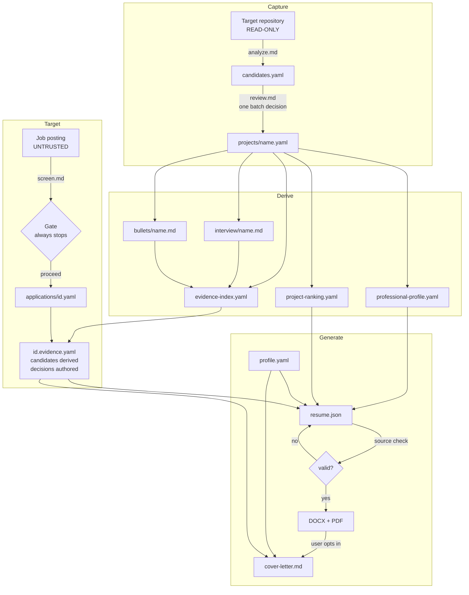

# Architecture

How the pieces fit, and why they are separated the way they are.

---

## The two-tree split

```
ekb-toolkit/          the toolkit    versioned, shared, pulled
  └── workspace/      your knowledge base    private, yours, its own repo
```

Personal career data and reusable procedure in the same directory is what makes
"can I share my setup?" a manual audit rather than a `git push`. Separating them
means the toolkit can be public and your knowledge base never has to be.

Resolution order for the workspace, first match wins:

1. `--workspace` / `--root` on a command line
2. `$EKB_WORKSPACE`
3. `paths.workspace` in `config/toolkit.yaml`
4. `<toolkit>/workspace`

Implemented in `scripts/ekb_paths.py`, used by every script.

## The three layers

### 1. Evidence — curated, append-only, authored with you

```
workspace/projects/<name>.yaml        curated records
workspace/context/<name>-questions.md the conversation behind them
workspace/profile/profile.yaml        confirmed facts about you
```

This is the only layer that contains facts. Everything else is derived from it
or renders it.

Written by exactly two procedures: `prompts/review.md` writes curated records,
`prompts/profile.md` writes confirmed facts. Nothing else may.

### 2. Retrieval — derived, regenerated, licenses nothing

```
workspace/profile/professional-profile.yaml   what holds across projects
workspace/profile/project-ranking.yaml        job-independent ordering
workspace/index/evidence-index.yaml           one row per record, findable
workspace/applications/<id>.evidence.yaml     candidates per requirement
```

This layer exists because selection is the step that determines output quality,
and doing it implicitly inside a generation turn is how the strongest evidence
gets missed.

The scale of the problem: a mature knowledge base is tens of thousands of lines
of YAML, and a resume shows roughly a dozen visible items. That is a selection
ratio of well under one percent, made in one pass, while also drafting,
formatting, linking, and validating. Nothing about it was written down, so
nothing could review it.

Now the comparison happens on paper first, and the file that holds it is
reviewable.

Every file in this layer is **derived and non-citable**. See
[concepts.md](concepts.md#derived-files-license-nothing).

### 3. Generation — disposable, always regenerable

```
workspace/artifacts/interview/<name>.md
workspace/artifacts/bullets/<name>.md
workspace/artifacts/bullets/impact-audit.json
workspace/artifacts/summaries/<venue>.md
workspace/artifacts/applications/<id>/resume.json → .docx, .pdf, validation.*
workspace/artifacts/applications/<id>/cover-letter.md
```

**Never hand-edited.** If an artifact is wrong, the record, the profile, or the
procedure is wrong. A hand-edited artifact is a claim with no evidence behind
it.

Each publishable project bullet carries a private single-line quality review in
addition to its source markers. The review records its outcome/impact/scope
altitude, result type, concrete change, metric decision, and the eight editorial
checks. The checker rejects activity-only selections, missing reviews, and
failed checks. Resume model version 2 carries the same review as structured JSON
and requires an exact match between review paths, public bullets, and evidence
references.

`impact-audit.json` is generated by `scripts/ekb bullet-audit`. It compares all
historical rendered bullet instances with the ranked banks without mutating old
application snapshots, reporting which wording stayed, improved, or retired.

This is also why artifact commits carry no Git tag: they can always be rebuilt
from the tagged curated YAML, so a tag would mark nothing.

## Prompts and scripts

The toolkit is deliberately half prompt and half script, split on one line:

> **Anything that needs judgement is a prompt. Anything that must give the same
> answer twice is a script.**

Judgement: deciding whether a commit range is career-relevant, whether a
statement is defensible, which record best answers a requirement, whether a
posting is worth a pass.

Determinism: building the index, computing candidate strength, checking that
every source reference resolves, grading coverage, rendering geometry,
scanning for secrets, staging a commit.

Putting determinism in a prompt produces a different answer every run. Putting
judgement in a script produces a wrong answer consistently.

## The pipeline



## Why resume selection and presentation are separate files

`prompts/resume.md` decides which evidence the document uses.
`prompts/resume-presentation.md` decides how it looks.

They were one file. Selection consistently lost attention to formatting rules:
by the time a generation turn had honored the hyperlink rules, the emphasis cap,
the punctuation gate, and the page budget, the question of whether the right
record had been chosen had quietly stopped being asked.

Splitting them makes the expensive judgement the whole subject of one file.

## Where the checks live

| Check | Where | Enforcement |
|---|---|---|
| Every visible fact has an eligible source | `resume_source_check.rb` | error |
| Involvement wording matches the record | `resume_source_check.rb` | error |
| Numbers are carried by a cited source | `resume_source_check.rb` | error |
| URLs exist in the registry and are confirmed | `resume_source_check.rb` | error |
| Projects sit under the right employer | `resume_source_check.rb` | error |
| Required requirement has a recorded decision | `resume_source_check.rb` | error |
| Forbidden punctuation and terms | `resume_render.py` | reject |
| Critical requirement `stated` with evidence unused | `resume_source_check.rb` | error |
| Same, non-critical | `resume_source_check.rb` | warning |
| Rank inversion with no reason | `resume_source_check.rb` | warning |
| Unlinked entity that has a confirmed address | `resume_source_check.rb` | warning |
| Underfilled page | `resume_render.py` | warning |
| Cross-file consistency | `ekb_check.py` | exit 1 |
| Skills basis drift | `ekb_skills.py` | exit 1 |
| Credential-shaped content before a commit | `ekb_git.sh` | refuse, fails closed |

The asymmetry is deliberate. Anything that could put an unsupported claim in
front of an employer is an error. Anything that only wastes an opportunity is a
warning.

## Git model

Two repositories, and the toolkit only ever writes to one of them.

**Target repositories** are strictly read-only. No writes, no execution of code,
builds, tests, hooks, or package-manager commands. Each analyze run verifies
that `git status --short` is byte-identical before and after.

**The workspace** gets local checkpoints through `scripts/ekb_git.sh`:

| Mode | Stages | Tag |
|---|---|---|
| `candidates` | the candidates file and its context | none |
| `snapshot` | curated records and context | `<project>/vN` |
| `artifact` | one generated file | none |
| `profile` | profile, derived profiles, ranking, policy | `profile/vN` |
| `application` | frozen posting, screening, shortlist, outputs | none |
| `screening` | frozen posting and screening only | none |

It refuses to run with a pre-populated index, stages only named paths, never
runs a broad `git add`, and **never pushes**.

Profile and application modes require recorded consent, because Git history
preserves deleted personal information permanently, and they scan changed files
for credential-shaped content first. That scan fails closed.

## Extension point

`profiles/<pack>/` is the only place a discipline is named. A pack supplies four
things: alignment anchors, misaligned archetypes, analysis hints, and
exclusions. Nothing outside that directory says "Flutter".

See [extending.md](extending.md).
